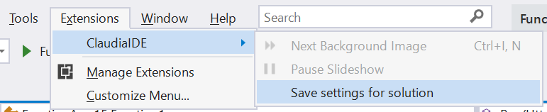
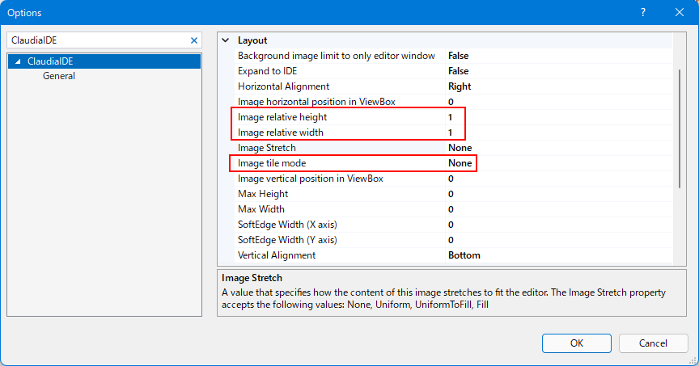
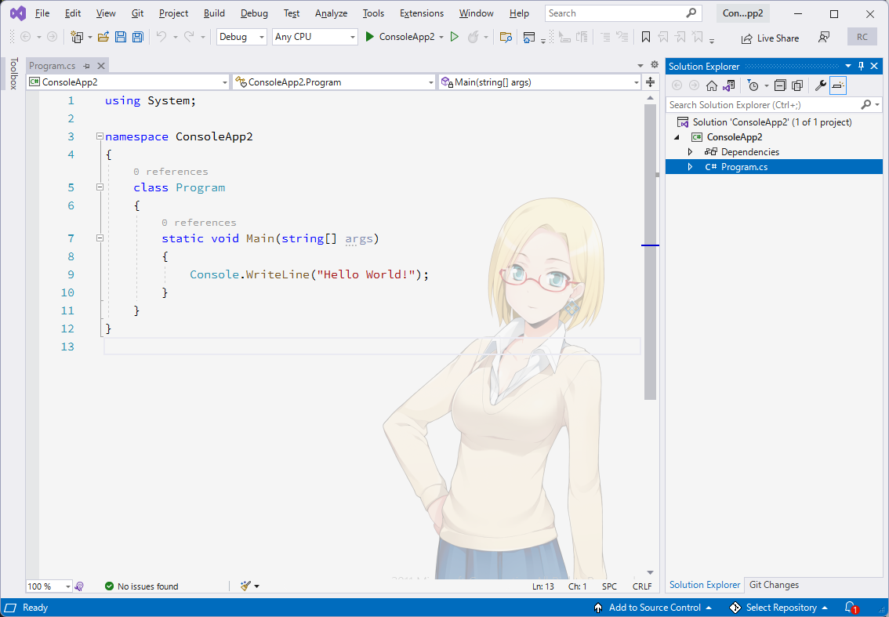
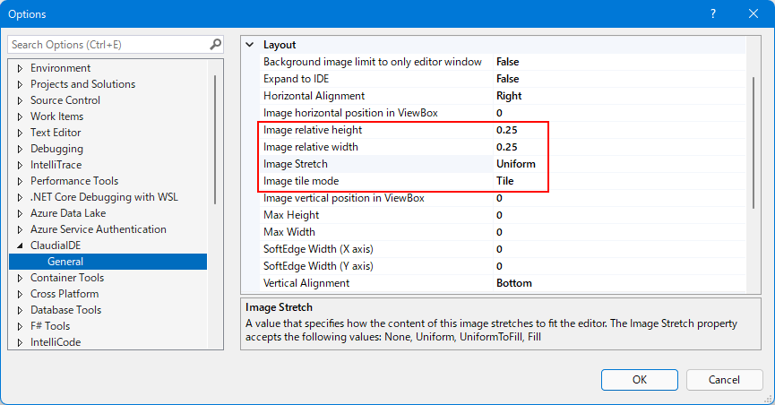
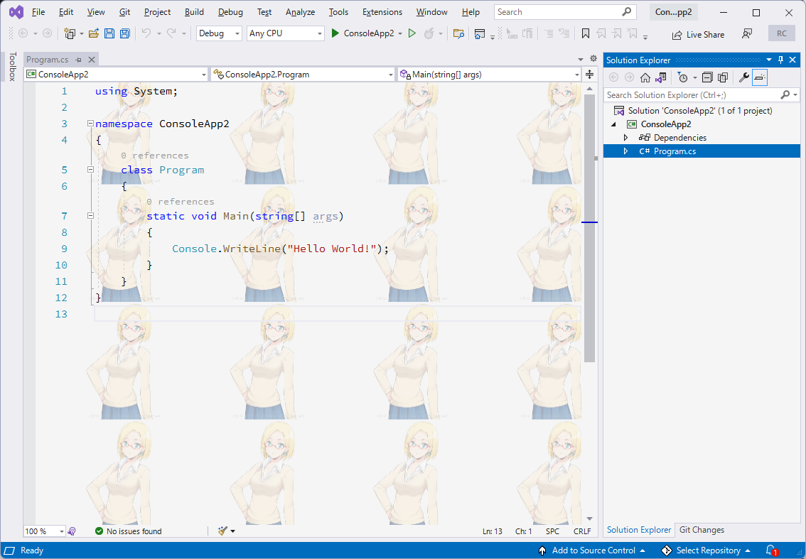
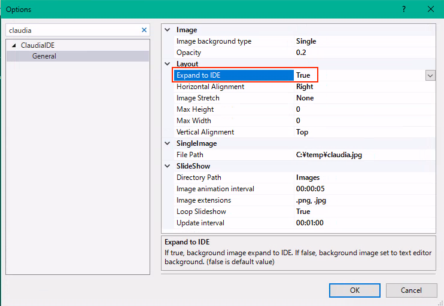
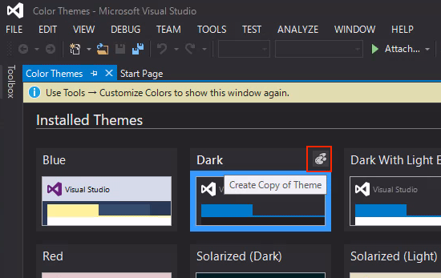
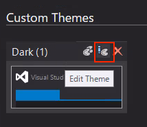
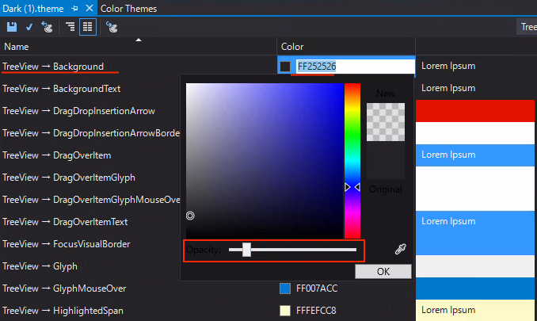
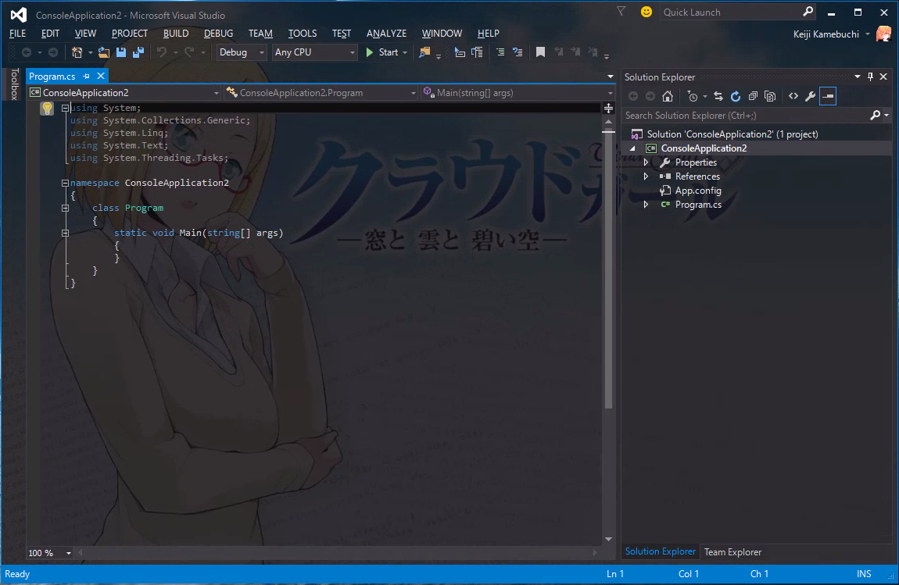

ClaudiaIDE
==========

This is a Visual Studio extension that lets you set a custom background image or slideshow.

## What's new

- Ver 3.1.16 Experimental support about animation gif and mp4 video file play in background.
- Ver 3.1.7 Support OS color theme setting and dark theme setting.
- Ver 3.1.6 Add `Toggle Background Image Visibility` menu. 
- Ver 3.0.3 Support tiled image in editor window.
- Ver 3.0.1 The ClaudiaIDE has been split into two Visual Studio versions, because the older version that needs to be resolved dependency of EnvDTE in Visual Studio 2022.
- Ver 3.0.0 support Visual Studio 2022 preview 1. However unfortunately drop off support for Visual Studio 2017. If you want support VS2017 ver, you can try use [ver 2.2.19](https://github.com/buchizo/ClaudiaIDE/releases/tag/Release2.2.19). Now mainstream is support Visual Studio 2019 and 2022 only.
- Ver 2.2.16 or later can support configuration per solution.

After save, this extension create .claudiaideconfig file in solution directory from current settings in option dialog. If you want to modify settings, you can modify this file (JSON format) or override via that menu.

#### Limitation

- Current feature of solution settings require restart Visual Studio after changed configfile.

## Versions

- This extension support some multiple versions Visual Studio, but it is not single VSIX/assembly file.

Visual Studio | support ClaudiaIDE
--|--
Visual Studio 2012 ~ 2015 | [1.28.6](https://github.com/buchizo/ClaudiaIDE/releases/tag/Release1.28.6)
Visual Studio 2017 | [2.2.19](https://github.com/buchizo/ClaudiaIDE/releases/tag/Release2.2.19)
Visual Studio 2019 | [2.2.19](https://github.com/buchizo/ClaudiaIDE/releases/tag/Release2.2.19) or [3.0.0.11](https://github.com/buchizo/ClaudiaIDE/releases/tag/Release3.0.0.11) or [3.0.1](https://github.com/buchizo/ClaudiaIDE/releases/tag/Release3.0.1)+
Visual Studio 2022 | [3.0.1](https://github.com/buchizo/ClaudiaIDE/releases/tag/Release3.0.1)+
Visual Studio 2026 | [3.0.1](https://github.com/buchizo/ClaudiaIDE/releases/tag/Release3.0.1)+

- After ver 3.0.1, I will single code maintenance that target to multiple Visual Studio versions. This mean build to some VSIX files as follows ClaudiaIDE.vsix (for VS2022) and ClaudiaIDE.16.vsix (for VS2019). If new Visual Studio major version (e.g. 18.x) release,  I'll add ClaudiaIDE17 (for VS2022). And ClaudiaIDE support version slide to new Visual Studio. (ClaudiaIDE's csproj support to always on latest Visual Studio)

## About options

### Tiled support

Ver 3.0.3+ support tiled image like as [WPF Tiling behavior](https://docs.microsoft.com/en-us/dotnet/desktop/wpf/graphics-multimedia/tilebrush-overview?view=netframeworkdesktop-4.8#tiling-behavior).

* nomal (default)

    
    

* tiled

    
    

### How to expand to IDE

1. Open option menu in Visual Studio (Tools -> Options)
2. Expand to IDE property set to True in ClaudiaIDE option page.

    

3. You can use [Transparency Theme](https://marketplace.visualstudio.com/items?itemName=pengweiqhca.transparency) extension. Or customise Visual Studio theme using color theme editor (E.g. [Visual Studio 2015 Color Theme Editor](https://visualstudiogallery.msdn.microsoft.com/6f4b51b6-5c6b-4a81-9cb5-f2daa560430b))
4. Click "Create Copy of Theme" button, And "Edit Theme"

     

5. Customise some colors opacity as follows (your own risk) :

    

* Solution Explorer
  * TreeView -> Background
* IDE and text editor
  * Environment -> Window
  * Environment -> EnvironmentBackground
  * Environment -> EnvironmentBackgroundGradientBegin
  * Environment -> EnvironmentBackgroundGradientEnd
  * Environment -> EnvironmentBackgroundGradientMiddle1
  * Environment -> EnvironmentBackgroundGradientMiddle2
* Window Title
  * Environment -> MainWindowActiveCaption
  * Environment -> MainWindowInactiveCaption
* Command Bar
  * Environment -> CommandShelfBackgroundGradientBegin
  * Environment -> CommandShelfBackgroundGradientEnd
  * Environment -> CommandShelfBackgroundGradientMiddle
  * Environment -> CommandShelfHighlightGradientBegin
  * Environment -> CommandShelfHighlightGradientEnd
  * Environment -> CommandShelfHighlightGradientMiddle
  * Environment -> CommandBarGradientBegin
  * Environment -> CommandBarGradientEnd
  * Environment -> CommandBarGradientMiddle
  * Environment -> CommandBarToolBarBorder

* Example:

    
