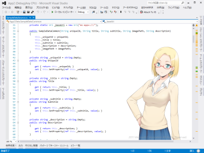

ClaudiaIDE
==========

`ClaudiaIDE` is a Visual Studio extension for displaying images in the background of the editor.

## Features

- Display images in the background of Visual Studio
  - Background of windows displaying text, such as text editors and XAML editors (some editors and windows are not supported)
  - Or the background of Visual Studio itself
- Selectable display formats
  - Display a specified image (local file path or URL)
  - Slideshow display of images under a specified folder
  - Display different images per text editor
  - Slideshow display of different images per text editor
  - Periodically call a Web API to display images from URLs in a JSON file as a slideshow
- Detailed image settings
  - Adjust display position
  - Adjust stretch
  - Adjust opacity and zoom level
  - Tile display
  - Edge blur processing
- Display area adjustments
  - Text editor only or Visual Studio itself
  - Fixed scroll background color adjustment
  - Scrollbar transparency
  - Editor background color change
- Supported file formats
  - Image files such as PNG, JPG, GIF
  - Animated GIF
  - Video files (MP4)
- Light theme and dark theme support
  - Individual settings for each
  - Can follow the OS system theme settings
- Solution-specific configuration using `.claudiaide` file

For setting details, please refer to [Settings](https://github.com/buchizo/ClaudiaIDE/wiki/Settings).

## What's new

- Ver 3.1.16 Experimental support about animation gif and mp4 video file play in background.
- Ver 3.1.7 Support OS color theme setting and dark theme setting.
- Ver 3.0.1 The ClaudiaIDE has been split into two Visual Studio versions, because the older version that needs to be resolved dependency of EnvDTE in Visual Studio 2022.
- Ver 3.0.0 support Visual Studio 2022 preview 1. However unfortunately drop off support for Visual Studio 2017. If you want support VS2017 ver, you can try use [ver 2.2.19](https://github.com/buchizo/ClaudiaIDE/releases/tag/Release2.2.19). Now mainstream is support Visual Studio 2019 and 2022 only.

## Installation

- [Installation and support versions](https://github.com/buchizo/ClaudiaIDE/wiki/Installation)

## Settings

- [Settings](https://github.com/buchizo/ClaudiaIDE/wiki/Settings)

## Release notes

- [Releases](https://github.com/buchizo/ClaudiaIDE/releases)
- [Notes](https://github.com/buchizo/ClaudiaIDE/wiki/Release-notes)

