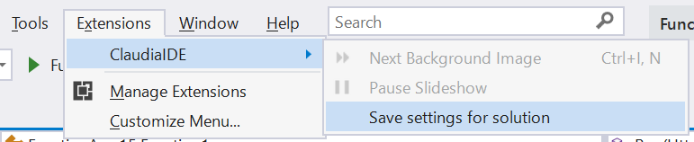
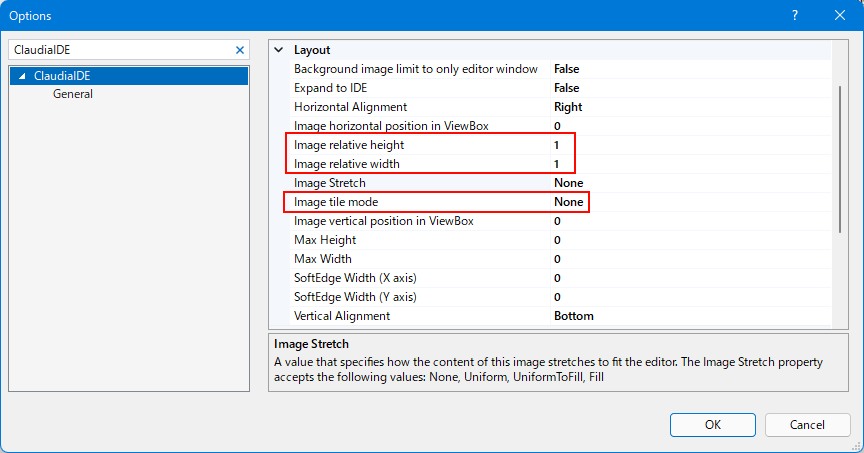
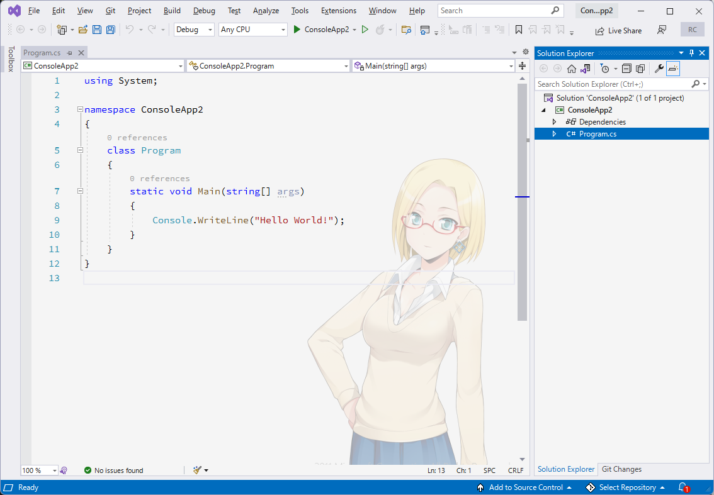
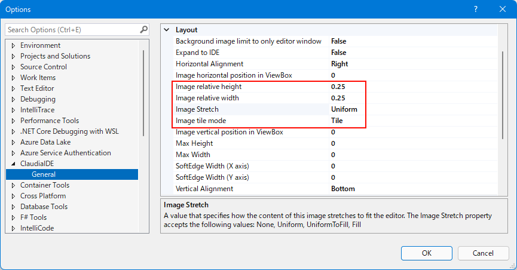
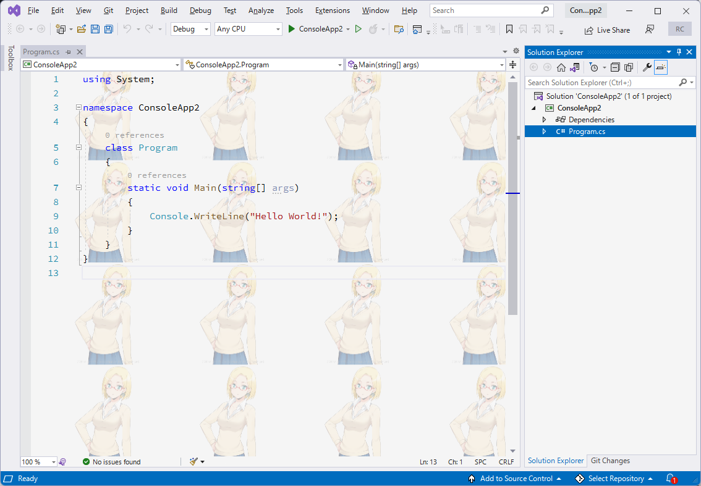

ClaudiaIDE
==========

This is a Visual Studio extension that lets you set a custom background image or slideshow.

## What's new

- Ver 3.1.7 Support OS color theme setting and dark theme setting.
- Ver 3.1.6 Add `Toggle Background Image Visibility` menu. 
- Ver 3.0.3 Support tiled image in editor window.
- Ver 3.0.1 The ClaudiaIDE has been split into two Visual Studio versions, because the older version that needs to be resolved dependency of EnvDTE in Visual Studio 2022.
- Ver 3.0.0 support Visual Studio 2022 preview 1. However unfortunately drop off support for Visual Studio 2017. If you want support VS2017 ver, you can try use [ver 2.2.19](https://github.com/buchizo/ClaudiaIDE/releases/tag/Release2.2.19). Now mainstream is support Visual Studio 2019 and 2022 only.
- Ver 2.2.16 or later can support configuration per solution.

After save, this extension create .claudiaideconfig file in solution directory from current settings in option dialog. If you want to modify settings, you can modify this file (JSON format) or override via that menu.

#### Limitation

- Current feature of solution settings require restart Visual Studio after changed configfile.

## Versions

- This extension support some multiple versions Visual Studio, but it is not single VSIX/assembly file.

Visual Studio | support ClaudiaIDE
--|--
Visual Studio 2012 ~ 2015 | [1.28.6](https://github.com/buchizo/ClaudiaIDE/releases/tag/Release1.28.6)
Visual Studio 2017 | [2.2.19](https://github.com/buchizo/ClaudiaIDE/releases/tag/Release2.2.19)
Visual Studio 2019 | [2.2.19](https://github.com/buchizo/ClaudiaIDE/releases/tag/Release2.2.19) or [3.0.0.11](https://github.com/buchizo/ClaudiaIDE/releases/tag/Release3.0.0.11) or [3.0.1](https://github.com/buchizo/ClaudiaIDE/releases/tag/Release3.0.1)+
Visual Studio 2022 | [3.0.1](https://github.com/buchizo/ClaudiaIDE/releases/tag/Release3.0.1)+

- After ver 3.0.1, I will single code maintenance that target to multiple Visual Studio versions. This mean build to some VSIX files as follows ClaudiaIDE.vsix (for VS2022) and ClaudiaIDE.16.vsix (for VS2019). If new Visual Studio major version (e.g. 18.x) release,  I'll add ClaudiaIDE17 (for VS2022). And ClaudiaIDE support version slide to new Visual Studio. (ClaudiaIDE's csproj support to always on latest Visual Studio)

## About options

### Tiled support

Ver 3.0.3+ support tiled image like as [WPF Tiling behavior](https://docs.microsoft.com/en-us/dotnet/desktop/wpf/graphics-multimedia/tilebrush-overview?view=netframeworkdesktop-4.8#tiling-behavior).

* nomal (default)

    
    

* tiled

    
    

### How to expand to IDE

1. Open option menu in Visual Studio (Tools -> Options)
2. Expand to IDE property set to True in ClaudiaIDE option page.

    

3. You can use [Transparency Theme](https://marketplace.visualstudio.com/items?itemName=pengweiqhca.transparency) extension. Or customise Visual Studio theme using color theme editor (E.g. [Visual Studio 2015 Color Theme Editor](https://visualstudiogallery.msdn.microsoft.com/6f4b51b6-5c6b-4a81-9cb5-f2daa560430b))
4. Click "Create Copy of Theme" button, And "Edit Theme"

     

5. Customise some colors opacity as follows (your own risk) :

    

* Solution Explorer
  * TreeView -> Background
* IDE and text editor
  * Environment -> Window
  * Environment -> EnvironmentBackground
  * Environment -> EnvironmentBackgroundGradientBegin
  * Environment -> EnvironmentBackgroundGradientEnd
  * Environment -> EnvironmentBackgroundGradientMiddle1
  * Environment -> EnvironmentBackgroundGradientMiddle2
* Window Title
  * Environment -> MainWindowActiveCaption
  * Environment -> MainWindowInactiveCaption
* Command Bar
  * Environment -> CommandShelfBackgroundGradientBegin
  * Environment -> CommandShelfBackgroundGradientEnd
  * Environment -> CommandShelfBackgroundGradientMiddle
  * Environment -> CommandShelfHighlightGradientBegin
  * Environment -> CommandShelfHighlightGradientEnd
  * Environment -> CommandShelfHighlightGradientMiddle
  * Environment -> CommandBarGradientBegin
  * Environment -> CommandBarGradientEnd
  * Environment -> CommandBarGradientMiddle
  * Environment -> CommandBarToolBarBorder

* Example:

    

## Version histories (summary)

### ver 2.2.x

Flickering has maybe been decreased, however the image fade interval option isn't supported for slideshows because problem effect by this update. If you want to expand the image to the full IDE window ("expand to IDE" option), ClaudiaIDE does not require theme editor. ClaudiaIDE automaticaly makes some backgrounds transparent (e.g. the text editor). However, for now, some windows, such as the solution explorer, still need to be made transaperent with theme editor, like as [Color Theme Editor for Visual Studio 2019](https://marketplace.visualstudio.com/items?itemName=VisualStudioPlatformTeam.VisualStudio2019ColorThemeEditor).

Enabling the option "User hardware graphics acceleration if available" will reduce flickering.

### ver 2.1.0

Support versions changed as follows:

* Visual Studio 2017 (15.8 or later)
* Visual Studio 2019 (preview or RTM)

#### Braking Changes

Visual Studio 2019 (16.1) extensions can support AsyncPackage only. ClaudiaIDE's this version change to AsyncPackage.

AsyncPackage can support Visual Studio 2015 or later. I decided move to forward and I don't support old Visual Studio versions (2017 15.8 or earlier). If you want to use this extension on old Visual Studio versions (2017 15.8 or earlier), you can use [1.28.6](https://github.com/buchizo/ClaudiaIDE/releases/tag/Release1.28.6). 

* If you already install 2.0.x to Visual Studio 2015 or Visual Studio 2017 (15.8 or ealier), you will uninstall 2.0.x and re-install 1.28.6 ClaudiaIDE.vsix.

### ver 1.28.6

Support Visual Studio 2019 Preview 1

### ver 1.26

Support Visual Studio 2017 (RTM)

### ver 1.24

* Add feature (beta) : background image expand to IDE.
  * Known issue: If background image expand to IDE, editor background does not show when editor was moved to floating window with slideshow until next image.

### ver 1.23

* Add image stretch feature and improve performance

### ver 1.19

* Additional support Visual Studio "15" Preview
* Can specifie max image size.

### ver 1.18

* Add slideshow feature.
* Support Visual Studio 2012/2013/2015

Download:

[ClaudiaIDE (Visual Studio Gallery)](http://visualstudiogallery.msdn.microsoft.com/9ba50f8d-f30c-4e33-ab19-bfd9f56eb817 "ClaudiaIDE (Visual Studio Gallery)") 

# License

## Microsoft Public License (Ms-PL)

This license governs use of the accompanying software. If you use the software, you accept this license. If you do not accept the license, do not use the software.

Definitions
The terms "reproduce," "reproduction," "derivative works," and "distribution" have the same meaning here as under U.S. copyright law.

A "contribution" is the original software, or any additions or changes to the software.

A "contributor" is any person that distributes its contribution under this license.

"Licensed patents" are a contributor's patent claims that read directly on its contribution.

Grant of Rights
(A) Copyright Grant- Subject to the terms of this license, including the license conditions and limitations in section 3, each contributor grants you a non-exclusive, worldwide, royalty-free copyright license to reproduce its contribution, prepare derivative works of its contribution, and distribute its contribution or any derivative works that you create.

(B) Patent Grant- Subject to the terms of this license, including the license conditions and limitations in section 3, each contributor grants you a non-exclusive, worldwide, royalty-free license under its licensed patents to make, have made, use, sell, offer for sale, import, and/or otherwise dispose of its contribution in the software or derivative works of the contribution in the software.

Conditions and Limitations
(A) No Trademark License- This license does not grant you rights to use any contributors' name, logo, or trademarks.

(B) If you bring a patent claim against any contributor over patents that you claim are infringed by the software, your patent license from such contributor to the software ends automatically.

(C) If you distribute any portion of the software, you must retain all copyright, patent, trademark, and attribution notices that are present in the software.

(D) If you distribute any portion of the software in source code form, you may do so only under this license by including a complete copy of this license with your distribution. If you distribute any portion of the software in compiled or object code form, you may only do so under a license that complies with this license.

(E) The software is licensed "as-is." You bear the risk of using it. The contributors give no express warranties, guarantees or conditions. You may have additional consumer rights under your local laws which this license cannot change. To the extent permitted under your local laws, the contributors exclude the implied warranties of merchantability, fitness for a particular purpose and non-infringement.
